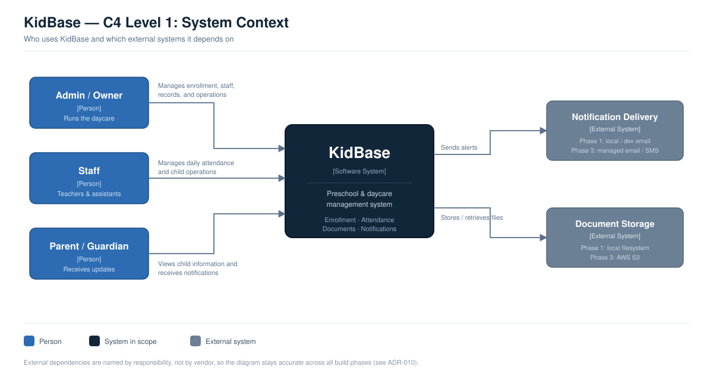
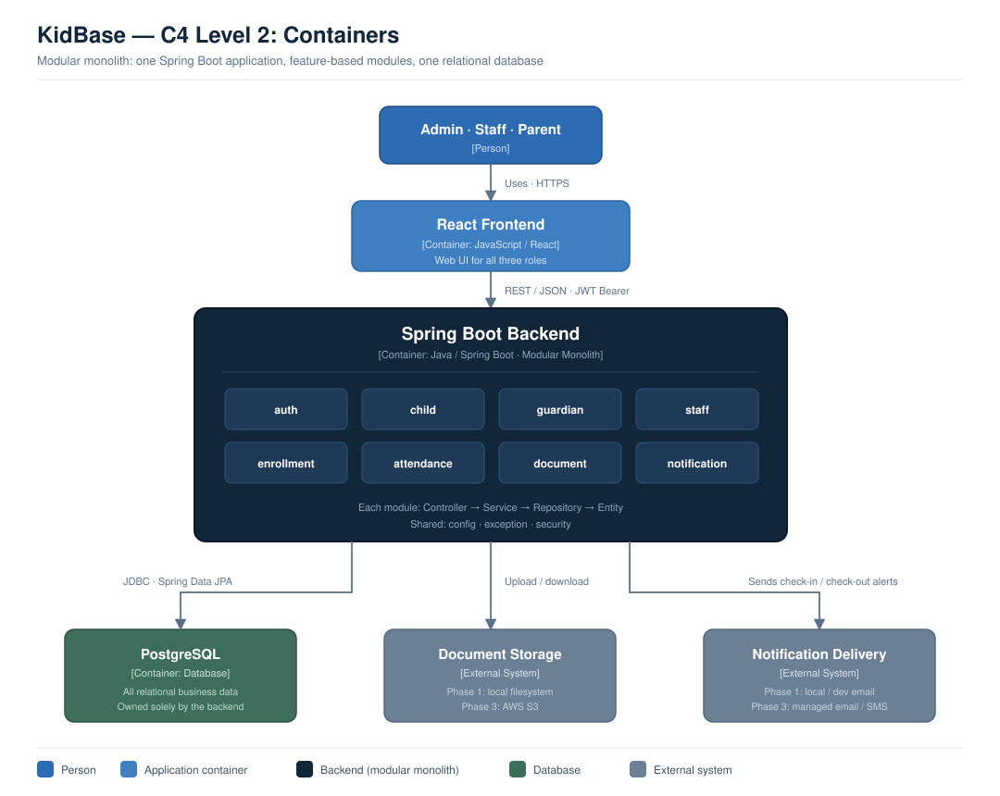
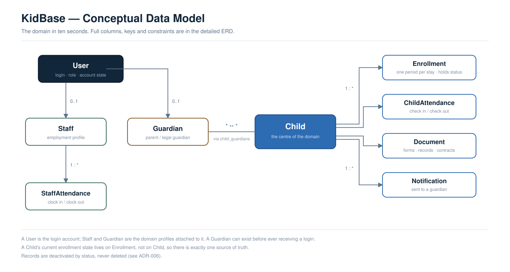
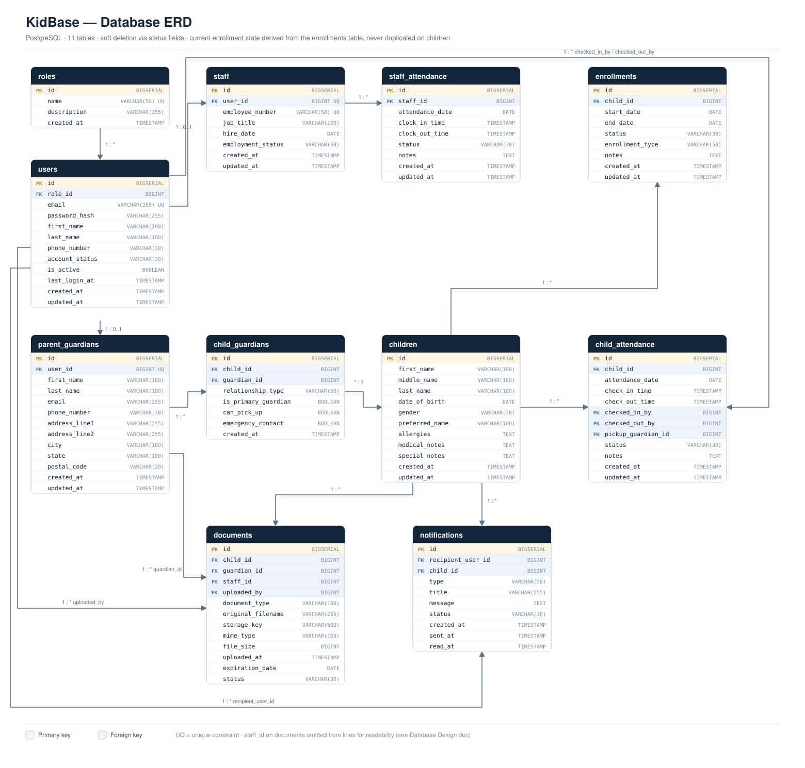
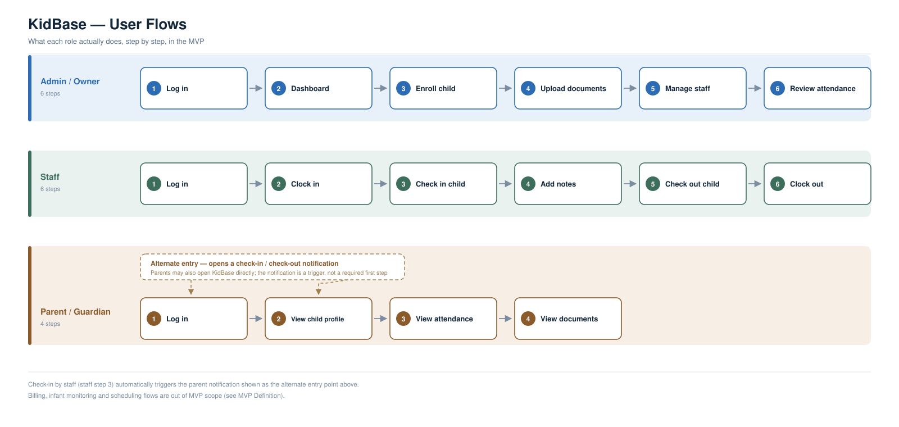

<div align="center">

# 🧸 KidBase

**A preschool & daycare management system, developed using a documented software engineering process.**

[](https://openjdk.org/)
[](https://spring.io/projects/spring-boot)
[](https://www.postgresql.org/)
[](https://maven.apache.org/)
[]()

</div>

---

## What is KidBase?

KidBase replaces the paper-based chaos of running a daycare — sign-in sheets, physical enrollment forms, folders of medical records, Zelle payments nobody tracks — with one centralized system for **owners, staff, and parents**.

It's being built for a real family daycare, so it has to actually hold up in daily use — not just look good in a demo. Along the way, the design decisions are written down as they're made instead of living only in my head.

## Why this project stands out

- **Documented like a real SDLC** — vision, stakeholders, requirements, user stories, MoSCoW prioritization, backlog, MVP scope, architecture, domain model, database design, and API design are all written down in [`docs/`](docs/), not just implied by the code.
- **11 Architecture Decision Records** — every non-obvious technical choice (modular monolith, soft deletes, JWT auth, feature-based packages...) has a written rationale and trade-off analysis in [`docs/adr/`](docs/adr/).
- **Diagrams, not just prose** — C4 context & container diagrams, a conceptual data model, a full ERD, and user-flow diagrams. See below.
- **Security-conscious by design** — the API design specifies that role escalation is blocked (public registration can never create an ADMIN/STAFF account) and that identity for sensitive actions (check-in/check-out) is always derived from the JWT, never trusted from the client. See [ADR-005](docs/adr/0005-public-registration-parent-role.md) and [ADR-009](docs/adr/0009-staff-identity-from-jwt.md).
- **Built in phases, on purpose** — core app first, then Docker, then AWS, then CI/CD. See [ADR-010](docs/adr/0010-build-in-phases.md).

## Architecture at a glance

**C4 Context** — who uses KidBase and what it talks to:



**C4 Container** — the modular monolith: one Spring Boot app, eight feature modules, one database:



## Data model

**Conceptual model** — the domain in ten seconds:



**Full ERD** — 11 PostgreSQL tables with keys and constraints:



## User flow

What each role actually does in the MVP:



## Tech stack

| Layer | Technology | Status |
| --- | --- | --- |
| Backend | Java 21, Spring Boot 4, Maven | Implemented |
| Database | PostgreSQL | Implemented |
| Persistence | Spring Data JPA, Hibernate | Implemented |
| Version Control | Git, GitHub | Implemented |
| Frontend | React | Planned |
| Security | Spring Security, JWT | Planned |
| Testing | JUnit, Mockito | Planned |
| API Docs | Swagger / OpenAPI | Planned |

The project currently ships a working Spring Boot + PostgreSQL backend skeleton with the module layout below; auth, security, the React frontend, and automated tests are designed (see [`docs/`](docs/)) but not yet built.

## Project structure

KidBase is organized as a **modular monolith** — one deployable Spring Boot app, internally split into self-contained feature modules ([ADR-011](docs/adr/0011-feature-based-package-organization.md)):

```
com.kidbase
├── auth            # login, JWT issuing/validation, roles
├── child           # child profiles
├── attendance      # child check-in/out, staff clock-in/out
├── staff           # staff profiles & employment info
├── guardian        # parent/guardian profiles & child links
├── enrollment      # enrollment periods & status
├── document        # upload/store/retrieve documents
├── notification    # parent alerts (check-in, check-out, incidents)
├── config          # cross-cutting configuration
├── exception       # centralized exception handling
├── security        # JWT filters, role-based access control
├── common          # shared utilities
└── KidBaseApplication
```

## MVP scope

**In scope:** authentication & role-based access, child enrollment, digital attendance check-in/check-out, staff management, and automatic parent notifications on check-in/check-out.

**Deliberately out of scope for v1:** billing/payments, infant monitoring logs, daily menus & activity scheduling, staff scheduling, analytics, and a full parent portal — see [`docs/08-mvp-definition.md`](docs/08-mvp-definition.md) for the full reasoning.

## Documentation

Everything below is version-controlled alongside the code, not scattered across chat logs or a wiki:

| # | Document |
| --- | --- |
| 01 | [Project Vision](docs/01-project-vision.md) |
| 02 | [Problem Discovery](docs/02-problem-discovery.md) |
| 03 | [Stakeholders](docs/03-stakeholders.md) |
| 04 | [Requirements](docs/04-requirements.md) |
| 05 | [User Stories](docs/05-user-stories.md) |
| 06 | [MoSCoW Prioritization](docs/06-moscow-prioritization.md) |
| 07 | [Product Backlog](docs/07-product-backlog.md) |
| 08 | [MVP Definition](docs/08-mvp-definition.md) |
| 09 | [System Design](docs/09-system-design.md) |
| 10 | [Architecture Design](docs/10-architecture-design.md) |
| 11 | [Domain Model](docs/11-domain-model.md) |
| 12 | [Database Design](docs/12-database-design.md) |
| 13 | [API Design](docs/13-api-design.md) |
| — | [Architecture Decision Records](docs/adr/) |
| — | [Diagrams](docs/diagrams/) |

## Getting started

**Prerequisites:** Java 21, Maven (or use the included wrapper), PostgreSQL running locally on **port 5433** (see `spring.datasource.url` in `application.properties` — this project does not use Postgres's default 5432).

**macOS / Linux (bash):**

```bash
# 1. Create the database (adjust -p if your local Postgres uses a different port)
createdb -p 5433 kidbase

# 2. Set your local PostgreSQL credentials as environment variables
export DB_USERNAME=postgres
export DB_PASSWORD=your_local_password

# 3. Run the app
./mvnw spring-boot:run
```

**Windows (PowerShell):**

```powershell
# 1. Create the database (adjust -p if your local Postgres uses a different port)
createdb -p 5433 kidbase

# 2. Set your local PostgreSQL credentials as environment variables
$env:DB_USERNAME = "postgres"
$env:DB_PASSWORD = "your_local_password"

# 3. Run the app
.\mvnw.cmd spring-boot:run
```

The API will be available at `http://localhost:8081`.

> Database credentials are read from `DB_USERNAME` / `DB_PASSWORD` environment variables in `src/main/resources/application.properties` — nothing sensitive is committed to the repo.

## Roadmap

| Phase | Focus |
| --- | --- |
| 1 — Core Application | Spring Boot + PostgreSQL, all modules working locally |
| 2 — Containerization | Docker + docker-compose |
| 3 — Cloud & Storage | AWS EC2/RDS, S3 for documents, SNS for notifications |
| 4 — CI/CD | GitHub Actions for automated testing & deployment |
| 5 — Future | Evaluate microservices, Kafka, Kubernetes if real scale demands it |

See [ADR-010](docs/adr/0010-build-in-phases.md) for the reasoning behind building this way.
